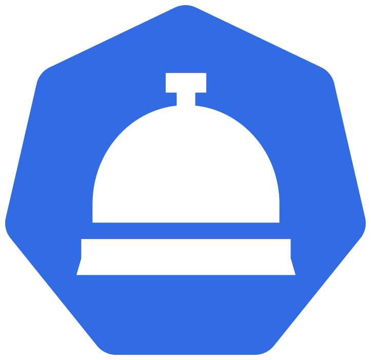

# Koncierge UI

<p align="center">
  
</p>

<p align="center">
  <strong>A modern, cross-platform Kubernetes port-forwarding manager</strong>
</p>

<p align="center">
  <a href="#features">Features</a> •
  <a href="#installation">Installation</a> •
  <a href="#getting-started">Getting Started</a> •
  <a href="#usage">Usage</a> •
  <a href="#command-line-interface-cli">CLI</a> •
  <a href="#faq">FAQ</a> •
  <a href="#contributing">Contributing</a>
</p>

---

## Overview

Koncierge UI is a cross-platform Kubernetes port-forwarding manager available both as a **desktop application** (built with .NET MAUI and Blazor) and a **command-line interface**. It provides an intuitive way to manage multiple port-forwards across different clusters, namespaces, and services without needing to remember complex `kubectl` commands.

## Features

### 🔗 Port Forwarding Management
- **Easy port-forward creation** - Forward ports from pods and services with just a few clicks
- **Template system** - Save frequently used port-forward configurations as reusable templates
- **Auto port assignment** - Use random ports (port 0) for automatic assignment of available local ports
- **Multi-cluster support** - Manage port-forwards across multiple Kubernetes clusters and contexts

### 🔍 Resource Browser
- **Pod browser** - View and filter pods by namespace, status, and name
- **Service browser** - Browse services with filtering by namespace and type
- **Multi-select filters** - Filter resources using multiple namespaces or statuses simultaneously
- **Real-time status** - See pod status with color-coded indicators

### 🔐 Secret Management
- **Linked secrets** - Associate Kubernetes secrets with port-forwards
- **Auto-copy credentials** - Quickly copy secret values to clipboard
- **Secret resolution** - Automatically resolve and display secret values for running forwards

### 🎨 User Experience
- **Dark/Light themes** - Automatic theme detection with manual override
- **Multi-language support** - Internationalization ready (English and more)
- **Connection logging** - Detailed logs for each port-forward connection
- **Persistent preferences** - Remember your selected cluster, theme, and language

### 💻 Cross-Platform
- **Windows** - Native Windows 10/11 support
- **macOS** - MacCatalyst support for Intel and Apple Silicon
- **iOS** - iPad support (experimental)
- **Android** - Tablet support (experimental)

### ⌨️ Command-Line Interface
- **Interactive mode** - Full menu-driven interface in the terminal
- **Scriptable commands** - Individual commands for automation and scripting
- **Shared configuration** - Uses the same templates and preferences as the GUI
- **Watch mode** - Monitor forwards with live log updates
- **Rich output** - Tables, colors, and status indicators

## Installation

### Prerequisites
- .NET 9 SDK
- A valid kubeconfig file with cluster access

### From Releases
Download the latest release for your platform from the [Releases](https://github.com/davidemaggi/koncierge-ui/releases) page.

#### Windows Code Signing
Windows releases are signed with a self-signed certificate. To avoid security warnings:
1. Download `KonciergeUI-CodeSigning.cer` from the release
2. Install it to your **Trusted Root Certification Authorities** store
3. See [docs/SIGNING.md](docs/SIGNING.md) for detailed instructions

**Note**: Self-signed certificates require manual trust installation. This is normal for open-source projects. See the signing documentation for security implications and instructions.

### Build from Source

```bash
# Clone the repository
git clone https://github.com/davidemaggi/koncierge-ui.git
cd koncierge-ui

# Restore dependencies
dotnet restore

# Build the solution
dotnet build

# Run the application (Windows)
dotnet run --project KonciergeUi.Client -f net9.0-windows10.0.19041.0

# Run the application (macOS)
dotnet run --project KonciergeUi.Client -f net9.0-maccatalyst
```

## Getting Started

### 1. Add Your Kubeconfig
On first launch, click **"Add Kubeconfig"** to import your Kubernetes configuration file. Koncierge UI will automatically discover all clusters and contexts defined in the file.

### 2. Select a Cluster
Use the cluster dropdown to select which Kubernetes cluster you want to work with.

### 3. Browse Resources
Navigate through the **Pods** or **Services** tabs to view available resources. Use the filters to narrow down by:
- Namespace (multi-select)
- Status (for pods)
- Type (for services)
- Free text search

### 4. Create a Port Forward
Click the **"Forward"** button on any port to create a new port-forward. Configure:
- Local port (or use 0 for automatic assignment)
- Protocol hint (HTTP, TCP, gRPC)
- Optional linked secrets

### 5. Save as Template (Optional)
Once you have configured your forwards, click **"Create Template"** to save the configuration for future use.

## Usage

### Managing Templates
Templates allow you to save and quickly start multiple port-forwards at once.

1. Create forwards from pods/services
2. Click **"Create Template"**
3. Give it a name and description
4. Start the template with one click from the Templates page

### Viewing Active Forwards
Navigate to the **Active Forwards** page to see all running port-forwards. From here you can:
- View connection logs
- Copy linked secret values
- Stop individual forwards or entire templates

### Filtering Resources
All resource tables support advanced filtering:
- **Multi-select namespaces** - Select multiple namespaces to view
- **Multi-select statuses** - Filter by multiple pod statuses
- **Text search** - Search by name across all visible resources
- **Clearable filters** - Use the X button to reset filters

## Project Structure

```
koncierge-ui/
├── KonciergeUi.Client/      # MAUI Blazor client application
│   ├── Components/          # Razor components (pages, layouts, modals)
│   ├── Services/            # App services (version provider)
│   ├── State/               # Application state management
│   └── wwwroot/             # Static assets
├── KonciergeUI.Cli/         # Command-line interface application
│   ├── Commands/            # CLI commands (cluster, pods, services, templates)
│   └── Infrastructure/      # DI and CLI infrastructure
├── KonciergeUI.Core/        # Core abstractions and interfaces
├── KonciergeUI.Data/        # Data persistence (preferences, templates)
├── KonciergeUI.Kube/        # Kubernetes integration
│   └── Repositories/        # K8s API wrappers
├── KonciergeUI.Models/      # Shared models and DTOs
├── KonciergeUI.Translations/# Localization resources
└── docs/                    # Documentation
```

## Command-Line Interface (CLI)

Koncierge UI also includes a powerful command-line interface for users who prefer terminal-based workflows or need to integrate with scripts and automation.

### Running the CLI

```bash
# Run directly with dotnet
dotnet run --project KonciergeUI.Cli

# Or build and run the executable
dotnet build KonciergeUI.Cli
./KonciergeUI.Cli/bin/Debug/net9.0/KonciergeUI.Cli
```

### Interactive Mode

Start the full interactive menu with all features:

```bash
koncierge interactive
# or
koncierge i
```

The interactive mode provides a guided menu for:
- 🔄 Switching clusters
- 📋 Listing pods and services
- 🔐 Viewing secrets and ConfigMaps
- ▶️ Creating quick port forwards
- 📁 Managing templates
- 📊 Viewing active forwards

### CLI Commands

#### Cluster Management
```bash
# List all available clusters
koncierge cluster list

# Select a cluster interactively or by name
koncierge cluster select
koncierge cluster select my-cluster
```

#### Resource Listing
```bash
# List pods (with optional namespace and cluster filters)
koncierge pods list
koncierge pods list -n kube-system -c my-cluster

# List services
koncierge services list
koncierge services list -n default

# List secrets and ConfigMaps
koncierge secrets list -n default
koncierge secrets list --show-values
```

#### Port Forwarding
```bash
# Create a quick port forward interactively
koncierge forward create

# Create with options
koncierge forward create -n default -t service -r my-service -p 8080 -l 8080

# List active forwards
koncierge forward list

# Stop a forward
koncierge forward stop
koncierge forward stop --all
```

#### Template Management
```bash
# List saved templates
koncierge template list

# Run a template
koncierge template run
koncierge template run "My Template" -c my-cluster

# Run with watch mode (shows logs and status updates)
koncierge template run "My Template" --watch

# Stop a running template
koncierge template stop
koncierge template stop --all

# Create a new template interactively
koncierge template create
```

### CLI Features

- **Shared configuration** - CLI uses the same templates and preferences as the GUI application
- **Interactive prompts** - When options are not provided, the CLI prompts for input with smart defaults
- **Rich terminal output** - Tables, colors, and status indicators using Spectre.Console
- **Watch mode** - Monitor running forwards with live log updates
- **Secret resolution** - View resolved secrets and ConfigMaps for running forwards

### Example Workflow

```bash
# 1. List and select a cluster
koncierge cluster list
koncierge cluster select production

# 2. Browse resources
koncierge pods list -n backend
koncierge services list -n backend

# 3. Run a saved template with logging
koncierge template run "Backend Dev" --watch

# 4. Or create a quick forward
koncierge forward create -t service -r api-gateway -p 8080

# 5. View active forwards
koncierge forward list

# 6. Stop when done
koncierge forward stop --all
```

## FAQ

### General

**Q: What Kubernetes versions are supported?**  
A: Koncierge UI uses the official Kubernetes C# client and supports any cluster version compatible with the client library (typically 1.20+).

**Q: Can I use multiple kubeconfig files?**  
A: Yes! You can add multiple kubeconfig files, and Koncierge UI will aggregate all clusters and contexts.

**Q: Where are my settings stored?**  
A: Settings are stored in a JSON file in your platform's application data folder.

### Port Forwarding

**Q: What does "Random" port mean?**  
A: When you set the local port to 0, the system automatically assigns an available port. The actual port number is displayed once the forward starts.

**Q: Why can't I start a template?**  
A: The "Start Template" button is disabled if any of the configured ports are already in use by another running forward. Check the tooltip for details on which ports conflict.

**Q: How does service port forwarding work?**  
A: When forwarding a service, Koncierge UI resolves the actual pod behind the service and uses the correct `targetPort` (container port), not the service port.

**Q: Why did my forward fail with "connection refused"?**  
A: This usually means the application inside the pod is not listening on the specified port. Verify the pod is running and the port is correct.

### Troubleshooting

**Q: Resources are not loading after changing clusters**  
A: Make sure you have proper RBAC permissions on the target cluster. Check the connection logs for detailed error messages.

**Q: Theme doesn't apply correctly on startup**  
A: The theme is resolved after the first render. This is normal behavior to support system theme detection.

**Q: Filters persist after changing clusters**  
A: This was a known issue and has been fixed. Filters now reset automatically when you change clusters.

## Contributing

Contributions are welcome! Please feel free to submit a Pull Request.

1. Fork the repository
2. Create your feature branch (`git checkout -b feature/AmazingFeature`)
3. Commit your changes (`git commit -m 'Add some AmazingFeature'`)
4. Push to the branch (`git push origin feature/AmazingFeature`)
5. Open a Pull Request

### Development Setup

```bash
# Install .NET 9 SDK
# Install MAUI workloads
dotnet workload install maui

# Clone and build
git clone https://github.com/davidemaggi/koncierge-ui.git
cd koncierge-ui
dotnet build
```

### Version Management
This project uses [GitVersion](https://gitversion.net/) for automatic semantic versioning. See [docs/release-process.md](docs/release-process.md) for details.

## License

This project is licensed under the MIT License - see the [LICENSE](LICENSE) file for details.

## Acknowledgments

- [MudBlazor](https://mudblazor.com/) - Material Design component library
- [KubernetesClient](https://github.com/kubernetes-client/csharp) - Official Kubernetes C# client
- [.NET MAUI](https://docs.microsoft.com/dotnet/maui/) - Cross-platform framework

---

<p align="center">
  Made with ❤️ by <a href="https://github.com/davidemaggi">Me</a>
</p>

